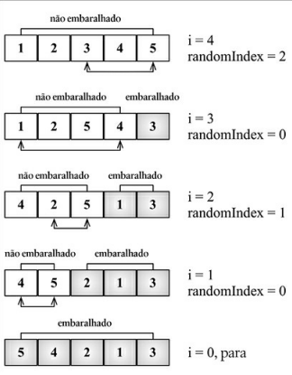

# Algoritos de Embaralhamento

- Como o próprio nome diz são algoritmos usados para fazer o embaralhamento de um array.

### Algoritmo de Fisher-Yates

- Esse algoritmo itera pelas posições do array , começando pela última e vai trocando a posição atual com alguma posição aleatória.
- A posição que será trocada sempre será menor que a posição atual.

 ;

> A implementação do Algoritmo está no arquivo SHUFFLE.