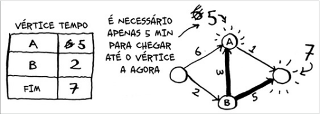

## Algoritmo de Dijkstra
- É um algoritmo que utilizar grafos ponderados.
- Diferentemente do algoritmo de Pesquisa em Largura, o Dijkstra ele acha o caminho mais **RÁPIDO** entre um ponto e outro e *NÃO* o menor caminho entre um ponto e outro.
- Este algoritmo não funciona em grafos **NÃO DIRECIONADOS**.
- Os 'Pesos' das arestas dos grafos não podem ser negativo, para que esse algortimo funcione. Só funciona com os 'pesos' das arestas positivos.

### Como Funciona
1. Encontre o Vértice mais 'barato', este é o vértice que você consegue chegar no menor tempo possível.
2. Atualize o custo do vizinho deste vértice.
3. Repita até fazer para todos os vértices.

- Encontrando o vertice mais barato
- No caso o vértice mais barato, ou mais rápido de se chegar seria o B.

- Atualizando os Custos do vizinho de B.
- Podemos perceber que se sairmos do primeiro vértice e ir direto para o vértice A, gastamos 6min. Se pegarmos outro caminho e saindo do primeiro vértice, passar pelo vértice B (2 min) e depois ir de B para o vértice A (3 min), no total do *Inicio-> B -> A*, gastamos apenas 5 min, mais rápido que ir direto do *início para o A*.
- Sabendo disso fazemos a atualização dos valores na tabela.
- Depois podemos perceber que se fizermos o caminho **Inicio -> B -> A -> Fim** gastamos 6 min mais rápido do que fazer o caminho de *Inicio -> A -> Fim* ou *Inicio -> B -> Fim*.

- REPITA !

> O arquivo JavaScript que está nesta pasta possui a implantação do Dijkstra.
