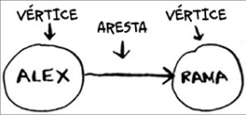
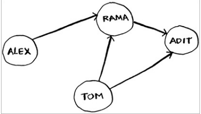
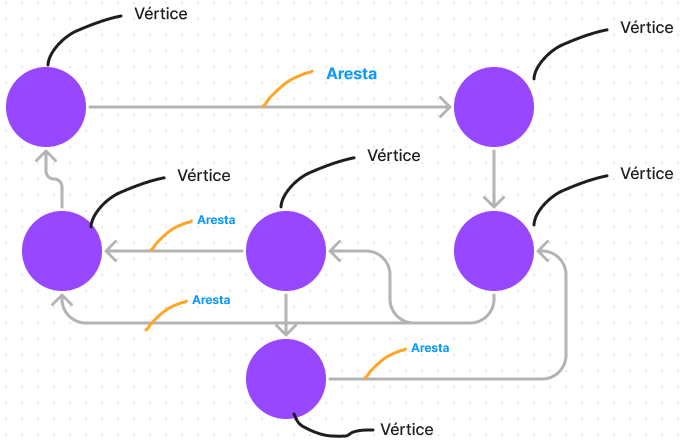
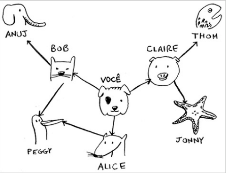
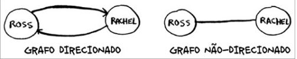

## Pesquisa em Largura
- O algoritmo de pesquisa em largura utiliza os grafos. 
- Este algoritmo busca pelo **menor** caminho entre um ponto e outro.
- Pode ser útil para alguns cenários, como : Corretor ortográfico, saber o menor número de moviementos necessários para ganhar um jogo de dama...

### Como funciona
- Primeiro ele procura nos vizinho de 1º grau, depois no de 2º grau e assim por diante.
- Fazendo a busca dessa maneira garante que o algortimo ache o caminho mais curto.
- Utilizaremos uma Fila para fazer estas verificações. Pois ela garante de que vamos faze a verificação na ordem em que o vértices foram adicionados.
- Primeiro o algoritmo faz a verificação nos vértices vizinho de 1º grau, se algum dos vértices satisfazerem a condição então o algoritmo acaba, caso contrário o algoritmo faz a busca nos próximos vértices e até encontrar algum que satisfaça a condição, caso não encontre retorna false.
- Também devemos usar uma lista de vértices que ja foram verificados, para evitar que vértices iguais sejam adicionados na nossa fila.
- No exemplo abaixo os vértices são tratados como pessoas, e a condição seria se elas fossem ou não vendedoras de mangas :

----------------------------------------------------------------------------------------------------------------------------------------------------------------------------------------------------------------------------------------------------------------------------------------------------------

## Grafos
- São conjuntos de conexões, formados por Aresta e Vértices.
- Um vértice pode ser conectados a vários outros vértices.
- Os vizinho são aqueles vértices que estão diretamente conectados uns aos outros.





----------------------------------------------------------------------------------------------------------------------------------------------------------------------------------------------------------------------------------------------------------------------------------------------------------

### Implementando Grafos em JavaScript
- Implementação do Grafo abaixo em JavaScript.
- Para fazer a implementações dos grafos usamos as tabelas hash.




```
const grafos = {};

//  ["Claire", "Bob", "Penny", "Tico"] -> Vizinhos
grafos.voce = ["Claire", "Bob", "Alice"];
grafos.Bob = ["Peggy", "Anuj"];
grafos.alice = ["Peggy"]
grafos.claire = ["Thom", "Jonny"]
grafos.peggy = [];
grafos.anuj = [];
grafos.thom = [];
grafos.jonny = [];

```


### Grafos Direcionados e Não direcionados
- Grafos direcionados são grafos que possuem somente um direção, somente um vizinho.
- Grafos não direcionados um vértice é vizinho do outro.




> No arquivo da pasta temos a implementação do Algoritmo Pesquisa em Largura, usando os grafos.
