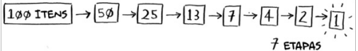
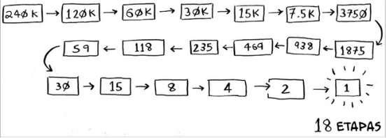

## Pesquisa Binária
- Este algoritmo funciona apenas com listas que estão ordenadas.
- Ele nos retorna a posição de um elemento específico dentro de uma lista. Se estivermos com uma lista pequena pode fazer isto passando por cada item que não teria o menor problema. Mas se estamos falando de uma lista com 1000 itens e queremos pegar a posição de um elemento que está na no indice 568, se for usar o método de passar por cada item da lista, demoraríamos 567 tentativas até chegar no item desejado, com a busca binária faríamos esta busca utilizando no MÁXIMO 10 tentativas.
- A pesquisa binária vai chutar um número intermediário da nossa lista, dessa maneira ela irá verificar se o número desejado é maior ou menor que a metade, desse jeito ja eliminamos metade da nossa lista. Como sobrou a outra metade ela novamente pega o número intermediário, e verifica se o número buscado é maior ou menor, eliminando novamente a metade da lista que sobrou,fazemos essa lógica até acharmos o item e retornarmos sua posição. Se o item buscado não for nem maior e nem menor que o item intermediário, significa que achamos o item buscado e só precisamos retornar sua posição.

#### Exemplo de uma lista com 100 itens :
- No máximo demoraríamos 7 tentivas até achar o item desejado.

#### Exemplo de uma lista com 240k itens :
- No máximo demoraríamos 18 tentivas até achar o item desejado.

