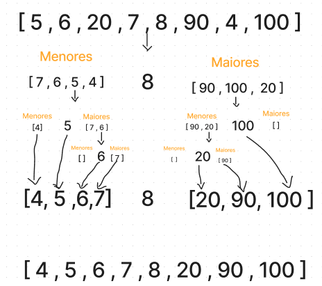

## Quicksort
- É um algoritmo melhor e mais rápido para se fazer a odernação de uma lista.
- Utiliza a técnica **DIVIDIR PARA CONQUISTAR**.

### Como funciona
- Primeiro precisamos escolher um pivô que pode ser qualquer elemento da nossa lista.
- Depois de escolher colocamos a esquerda desse elemento, um array com todos os elementos menores que ele, e a direita um array com todos os elementos maiores que ele.
- Depois para cada um dos arrays vamos fazer a mesma coisa. Escolher um pivô, colocar a esquerda os elementos menores e a direita os elementos maiores.
- vamos fazendo até que o nosso array chegue em 1 elemento apenas. Então fazemos a junção de tudo e pronto ordenamos nossa lista.
- Para melhorar o desempenho do nosso algoritmo é sempre bom escolher o pivô como um elemento do meio do array.

---------------------------------------------------------------------------------------------------------------------------------------------------------------------------------------------------------------

## Dividir para Conquistar
