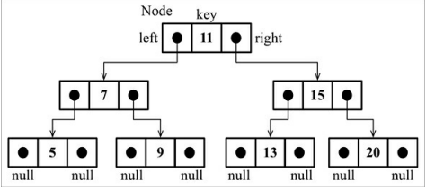
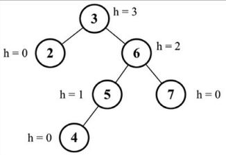

# Árvores

- Estrutura de Dados não sequencial.
- Ótima para armazenar informações que devam ser encontradas facilmente.
- Uma árvore é constituída de nós, com relacionamento de pai-filho. Todo nó possui um pai ( exceto o primeiro ) e também zero ou mais filhos.
- O primeiro nó , ou seja, o nó que não possui pai é chamado de raiz.
  - ***Nó Interno →*** São aqueles que possuem pelo menos um filho.
  - ***Nó Externo ou Folha →*** São aqueles nós que não possuem filhos.
  - ***Ancestrais de um nó →*** O ancestral de um nó é o pai, vô, bisavô e assim por diante.
  - ***Descendentes de um nó →***  São os filhos, netos, bisnetos e assim por diante.

    

- Uma subárvore é composta de um nó e seus descendentes.
- A profundidade de um nó é medida pela quantidade de ancestrais que esse nó possui, por exemplo: o nó 5 tem uma profundidade de 2, pois possui 2 ancestrais.
- As árvores também podem ser medidas em níveis, onde a raiz será o nível 0, seus filhos nível 1, seus netos nível 2 e assim sucessivamente.
- A altura de uma árvores poderá ser medida de acordo com a profundidade máxima de um nó. Nesse exemplo temos uma altura de 3, pois a maior profundidade de um nó é 3.

--------------------------------------------------------------------------------------------------------------

### Árvore Binária  e Árvore Binária de Busca

- Uma árvore binária possui no máximo 2 filhos, um a esquerda e um a direita.
- Uma árvore binária de busca ela armazena que do lado esquerdo do nó seja armazenado somente os nós com valores menores e do lado direito somente os nós com valores maiores.O diagrama acima representa uma Árvore Binária de Busca.

--------------------------------------------------------------------------------------------------------------

#### Criando uma Árvore Binária de Busca

- Trabalharemos com ponteiros para representar a conexão entre os nós. Usaremos um ponteiro para referenciar o nó à esquerda e outro para referenciar um nó à direita.
- Para fazer essa conexão usaremos a classe NODE, para fazer a criação dos nós. E utilizaremos a palavra KEY para fazer referência a um nó, pois é essa palavra que é conhecida na terminologia de árvores.

~~~javascript
  export class Node{
    constructor(key){
      this.key = key; // Valor do Nó
      this.left = null; // Valor referentes ao nó da esqueda ( nó menor )
      this.right = null; // Valor referentes ao nó da direita ( nó maior )
    };
  };
~~~

- Exemplo de uma BST(Binary Search Tree) :

  

- Métodos que serão implementados :
  - **insert(key):** esse método insere uma nova chave na árvore.
  - **search(key):** esse método busca a chave na árvore e devolve true se
    ela existir, e false se o nó não existir.
  - **inOrderTraverse():** esse método visita todos os nós da árvore usando
    um percurso em-ordem.
  - **preOrderTraverse():** esse método visita todos os nós da árvore
    usando um percurso pré-ordem.
  - **postOrderTraverse():** esse método visita todos os nós da árvore
    usando um percurso pós-ordem.
  - **min():** esse método devolve a chave/valor mínimo da árvore.
  - **max():** esse método devolve a chave/valor máximo da árvore.
  - **remove(key):** esse método remove a chave da árvore.

- Para criar estes métodos utilizares bastante recursão.

--------------------------------------------------------------------------------------------------------------

### Inserindo uma Chave

- Temos dois casos, o primeiro é se estamos inserindo a chave na primeira posição.
- O segundo é inserir uma chave em uma posição que não seja a primeira. Para isso usaremos uma função auxiliar.

~~~javascript
  insert(key) {
    if (this.root === null) {
      this.root = new Node(key);
    }else{
      this.insertNode(this.root, key);
    };
  };
~~~

- A função insertNode nos ajudará a inserir um novo nó.

~~~javascript
  insertNode(node, key) {
    if (this.compareFn(node, key) === Compare.LESS_THAN) {
      if (node.left === null) {
        node.left = new Node(key);
      } else {
        this.insertNode(node.left, key);
      };
    } else {
      if (node.right === null) {
        node.right = new Node(key);
      } else {
        this.insertNode(node.right, key);
      };
    }
  };
~~~

--------------------------------------------------------------------------------------------------------------

### Percorrendo uma Árvore

- Percorrer uma árvore é simplesmente passar por todos os nós dela e executar executar uma operação em cada um dos nós.

##### Percurso em ordem

- Visita todos os nós da nossa árvores em ordem crescente. Podemos utilizá-lo para fazer a ordenação de uma árvore.

~~~javascript
  inOrderTraverse(callback){
    this.inOrderTraverseNode(this.root, callback);
  };

  inOrderTraverseNode(node, callback){
    if(node !== null){
      this.inOrderTraverseNode(node.left, callback);
      callback(node.key);
      this.inOrderTraverseNode(node.right, callback);
    };
  };
~~~

- Caminho que o método percorre :

  

##### Percurso Pré-Ordem

- Visita o nó antes de visitar o seus descendentes.
- Percorre primeiro o nó raiz, depois o nó a esquerda e por  último o nó a direita.

~~~javascript
  preOrderTraverse(callback) {
    this.preOrderTraverseNode(this.root, callback);
  };

  preOrderTraverseNode(node, callback){
    if (node !== null) {
      callback(node.key);
      this.inOrderTraverseNode(node.left, callback);
      this.inOrderTraverseNode(node.right, callback);
    };
  };
~~~

- Caminho que o método percorre :

  

##### Percurso Pós-Ordem

- Visita um nó somente depois de visitar os seus descendentes.
- Primeiro percorrerá o nó a esquerda, depois o nó a direita e por último o nó raiz.

~~~javascript
  postOrderTraverse(callback) {
    this.postOrderTraverseNode(this.root, callback);
  };

  postOrderTraverseNode(node, callback) {
    if (node !== null) {
      this.inOrderTraverseNode(node.left, callback);
      this.inOrderTraverseNode(node.right, callback);
      callback(node.key);
    };
  };
~~~

- Caminho que o método percorre :

  

---------------------------------------------------------------------------------------------------------------

#### Pesquisa de Valores

- Valores mínimos e máximos:
  - Podemos perceber que sempre o nó mínimo da nossa árvores estará a esquerda no último nível. E o nó máximo a direita no último nível.
  
  

~~~javascript
  min() {
    return this.minNode(this.root);
  };

  minNode(node) {
    let current = node;
    while (current != null && current.left != null) { 
      current = current.left; 
    };
    return current; 
  };

  max() {
    return this.maxNode(this.root); 
  };

  maxNode(node) {
    let current = node;
    while (current != null && current.right != null) { 
      current = current.right; 
    };
    return current; 
  };
~~~

--------------------------------------------------------------------------------------------------------------

#### Valor Específico

~~~javascript
  search(key) {
    return this.searchNode(this.root, key);
  };

  searchNode(node, key) {
    if (node == null) {
      return false;
    };
    if (this.compareFn(key, node.key) === Compare.LESS_THAN) {

      return this.searchNode(node.left, key);

    } else if (this.compareFn(key, node.key) === Compare.BIGGER_THAN) {

      return this.searchNode(node.right, key);
    
    } else {
      return true;
    };
  };
~~~

--------------------------------------------------------------------------------------------------------------

#### Removendo um Nó

~~~javascript
  remove(key) {
    this.root = this.removeNode(this.root, key);
  };

  removeNode(node, key) {
    if (node == null) {
      return null;
    };
    if (this.compareFn(key, node.key) === Compare.LESS_THAN) {
      node.left = this.removeNode(node.left, key);
      return node;
    } else if ( this.compareFn(key, node.key) === Compare.BIGGER_THAN) {
      node.right = this.removeNode(node.right, key);
      return node;
    } else {

      if (node.left == null && node.right == null) {
        node = null;
        return node;
      };

      if (node.left == null) {
        node = node.right;
        return node;
      } else if (node.right == null) {
        node = node.left;
        return node;
      };

      const aux = this.minNode(node.right);
      node.key = aux.key;
      node.right = this.removeNode(node.right, aux.key);
      return node;
    };
  };
~~~

- Na implementação acima estaremos encontrando a chave que estamos procurando, a partir disso teremos 3 cenários para tratar :
  1. Nó folha. Tudo que temos que fazer é atribuir o valor para este nó.

    

  2. Nó possui um filho a esquerda ou direita. Neste cenário podemos pular esse nó e fazer o pai apontar diretamente para o filho.

    
  
  3. Removendo um nó com dois filhos. Para remover este iremos achar o nó mínimo da sua subárvore à direita e então substituir. Neste queremos remover o 15, então vamos para a subárvore dele à direita e achamos o menor nó, que no caso é o 18, então simplesmente substituimos o 15 por 18.

    
  
--------------------------------------------------------------------------------------------------------------

#### Árvores autobalanceadas

- As árvores BST possuem um problema, conforme ocorre as adições de elementos, um dos lados poderá ter uma profundidade maior que do outro lado :

  
- Este tipo de árvore pode causar problemas no desempenho total da árvore. Por conta deste problema existem as árvores AVL que são arvores BST autobalanceadas.

##### Árvores AVL

- Tenta se autobalancear sempre que um nó é adicionado ou removido.
- Criando a nossa class AVL :

    ~~~javascript
      class AvlTree extends BinarySearchTree {
        constructor(compareFn = defaultCompare) {
          this.compareFn = compareFn;
          this.root = null;
        };
      };
    ~~~

  - Os métodos insert e remove da árvore AVL, são semelhantes ao da BST, a única diferença é que iremos verificar o fator de balanceamento da árvore e aplicar a lógica adequada.
  - Altura de um NÓ :
    - É a quantidade máxima de arestas que temos do nó até qualquer uma de suas folhas.

    
  
  - Calculando a altura de um nó :

    ~~~javascript
      getNodeHeight(node) {
          if (node == null) {
            return -1;
          };
          return Math.max(this.getNodeHeight(node.left), this.getNodeHeight(node.right)) + 1;
      };
    ~~~

- Calculando o fator de balanceamento :
  - Sempre que um nó for adicionado ou removido, deveremos calcular a diferença entre a subárvore do lado direito e também a do lado esquerdo, esse cálculo deverá ser 0, 1 ou -1, se der qualquer valor diferente disso significa que a árvore deve ser balanceada.

  

- Para calcular o fator de balanceamento , iremos primeiro criar uma constante, para guardar os status do balanceamento da nossa árvores :

    ~~~javascript
      const BalanceFactor = {
      UNBALANCED_RIGHT: 1,
      SLIGHTLY_UNBALANCED_RIGHT: 2,
      BALANCED: 3,
      SLIGHTLY_UNBALANCED_LEFT: 4,
      UNBALANCED_LEFT: 5
    };
    ~~~

- Calculando o fato de balanceamento :

    ~~~java
    getBalanceFactor(node) {
        const heightDifference = this.getNodeHeight(node.left) -
          this.getNodeHeight(node.right);
        switch (heightDifference) {
          case -2:
            return BalanceFactor.UNBALANCED_RIGHT;
          case -1:
            return BalanceFactor.SLIGHTLY_UNBALANCED_RIGHT;
          case 1:
            return BalanceFactor.SLIGHTLY_UNBALANCED_LEFT;
          case 2:
            return BalanceFactor.UNBALANCED_LEFT;
          default:
            return BalanceFactor.BALANCED;
        };
      };
    ~~~

- Depois de verificarmos se a árvore precisa ou não ser balanceada, temos 2 processos de balanceamento que podemos usar :
  - Rotação Simples ou  a Rotação dupla :
    - ***LL:*** é uma rotação simples à direita;
    - ***RR:*** é uma rotação simples à esquerda;
    - ***LR :*** é uma rotação dupla à direita;
    - ***RL:*** é uma rotação dupla à esquerda;

  - ***Rotação LL →*** Quando a altura de um filho a esquerda é maior que de um filho a direita.

  

  ~~~javascript
    rotationLL(node) {
    const tmp = node.left;
    node.left = tmp.right; 
    tmp.right = node; 
    return tmp;
  };
  ~~~

  - ***Rotação RR →*** → o inverso da rotação LL. Quando a altura de um filho a direita é maior que a do filho á esquerda.

  

  ~~~javascript
    const tmp ={ node.right; // {1}
  node.right = tmp.left; // {2}
  tmp.left = node; // {3}
  return tmp;
  };
  ~~~

  - ***Rotação LR →*** Quando a altura de um filho a esquerda é maior que de um filho a direita, e  o filho a esquerda é mais pesado a direita.
    - Basicamente fazemos uma Rotação LL e depois uma Rotação RR.
  
  

  ~~~javascript
  rotationLR(node) {
    node.left = this.rotationRR(node.left);
    return this.rotationLL(node);
  };
  ~~~

  - ***Rotação RL →***  Quando a altura de um filho a direita é  maior que de um filho a esquerda, e  o filho a  direita é mais pesado a esquerda.

  

  ~~~javascript
    rotationRL(node) {
    node.right = this.rotationLL(node.right);
    return this.rotationRR(node);
  };
  ~~~

-------------------------------------------------------------------------------------------------------------

#### Inseindo Nó em uma Árovre AVL

- Após a inserção do nó verificaremos se a árvores continua balanceada, senão aplicaremos os métodos de rotação necessário.
- Método de inserção :

    ~~~javascript
    insert(key) {
        this.root = this.insertNode(this.root, key);
      };
    
      insertNode(node, key) {
        // Insere o nó igualmente como é feito em uma BST
    
        if (node == null) {
          return new Node(key);
        } else if (this.compareFn(key, node.key) === Compare.LESS_THAN) {
          node.left = this.insertNode(node.left, key);
        } else if (this.compareFn(key, node.key) === Compare.BIGGER_THAN) {
          node.right = this.insertNode(node.right, key);
        } else {
          return node;
        };
    
        // Balanceamento da Árvore se necessário
        const balanceFactor = this.getBalanceFactor(node);
        if (balanceFactor === BalanceFactor.UNBALANCED_LEFT) {
          if (this.compareFn(key, node.left.key) === Compare.LESS_THAN) {
            node = this.rotationLL(node);
          } else {
            return this.rotationLR(node);
          };
        };
    
        if (balanceFactor === BalanceFactor.UNBALANCED_RIGHT) { // {6}
          if (this.compareFn(key, node.right.key) === Compare.BIGGER_THAN) {
            node = this.rotationRR(node);
          } else {
            return this.rotationRL(node);
          };
        };
        return node;
      };
    ~~~

--------------------------------------------------------------------------------------------------------------

#### Removendo um nó da árvores AVL

- Após a remoção do nó verificaremos se a árvores continua balanceada, senão aplicaremos os métodos de rotação necessário.
- Método de remoção :

  ~~~javascript
    removeNode(node, key) {
    node = super.removeNode(node, key); 
    if (node == null) {
      return node; 
    };

    // Vendo se a árvores está balanceada
    const balanceFactor = this.getBalanceFactor(node); 

    if (balanceFactor === BalanceFactor.UNBALANCED_LEFT) { 
      const balanceFactorLeft = this.getBalanceFactor(node.left); 
      if ( balanceFactorLeft === BalanceFactor.BALANCED || balanceFactorLeft === BalanceFactor.SLIGHTLY_UNBALANCED_LEFT) { 
        return this.rotationLL(node); 
      };

      if ( balanceFactorLeft === BalanceFactor.SLIGHTLY_UNBALANCED_RIGHT) { 
        return this.rotationLR(node.left); 
      };
    };

    if (balanceFactor === BalanceFactor.UNBALANCED_RIGHT) { 
      const balanceFactorRight = this.getBalanceFactor(node.right); 
      if (balanceFactorRight === BalanceFactor.BALANCED ||balanceFactorRight === BalanceFactor.SLIGHTLY_UNBALANCED_RIGHT) { 
        return this.rotationRR(node); 
      };

      if ( balanceFactorRight === BalanceFactor.SLIGHTLY_UNBALANCED_LEFT) {
        return this.rotationRL(node.right); 
      };

    };
    return node;
  };
  ~~~
