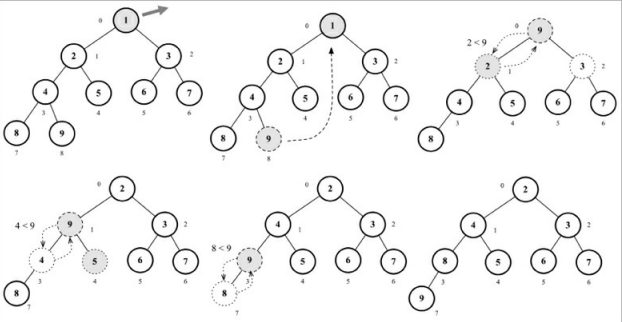

# Heap Binário

- É uma árvore binária, porém não necessariamente é uma BST, pois no ***heap*** binário os filhos devem maiores ou igual ao nó pai, ou menor ou igual a ele, já na BST os filhos à esquerda são sempre menores e os da direita maiores.
- Temos os Heaps mínimos e máximos :
  - ***Heap mínimo :*** Permite pegar rapidamente o valor mínimo da árvore.
    - Nesse tipo, todos os nós filhos devem ser maiores ou iguais ao seu nó pai.

  - ***Heap máximo :*** Permite pegar rapidamente o valor máximo da árvore.
    - Nesse tipo, todos os nós filhos devem ser menores ou iguais ao seu nó pai.

        

--------------------------------------------------------------------------------------------------------------

# Criando Clase MinHeap

~~~javascript
  import { defaultCompare } from "./auxFn";

  export class MinHeap {
    constructor(compareFn = defaultCompare) {
      this.compareFn = compareFn;
      this.heap = [];
    };
  };
~~~

- A função defaultCompare faz a comparação entre valores e para fazer o armazenamento estamos utilizando um array.
- Nesta implementação estaremos usando o array para representar a nossa árvore binária :

  
  - Para acessar os nós da árvore usando o array, temos que manipular os índices dessa maneira:
    - ***Filho a Esquerda →*** 2 * index + 1;
    - ***Filho a Direita →*** 2 * index + 2;
    - ***Nó Pai →*** index / 2;
  
  - Métodos para acessar os nós :

  ~~~javascript
    getLeft(index) {
      return 2 * index + 1;
    };

    getRight(index) {
      return 2 * index + 2;
    };

    getFather(index) {
      if (index === 0) undefined;

      return Math.floor((index - 1) / 2);
    };
  ~~~

--------------------------------------------------------------------------------------------------------------

### Operações

- Podemos usar 3 operações nessa estrutura de dados :
  - ***Insert →*** Insere um novo valor e retorna true se ele foi inserido com sucesso e false caso contrário.
  - ***Extract →*** Remove o valor mínimo ou máximo e devolve o valor.
  - ***findMinimum →*** Devolve o valor mínimo ou máximo sem removê-lo;

#### Insert

- Para a inserção de valores no HEAP, iremos adicionar o nosso value na última posição do nosso array, e depois executar a função siftUp, que simplesmente troca o nosso value pelo pai até que o pai seja menor que o value que estamos inserindo, afinal no heapMínimo todos os nós filhos devem ser maiores ou iguais ao nó pai.

~~~javascript

  insert(value) {
    if (value !== null) {
      this.heap.push(value);
      this.siftUp(this.heap.length - 1);
      return true;
    };

    return false;

  };

  siftUp(index) {
    let parent = this.getParentIndex(index);

    while (index > 0 && this.compareFn(this.heap[parent], this.heap[index] > Compare.BIGGER_THAN)) {
      swap(this.heap, parent, index);
      index = parent;
      parent = this.getParentIndex(index);
    };
  };

  swap(arr, a, b) {
    return [arr[a], arr[b]] = [arr[b], arr[a]];
  };

~~~

- O diagrama a seguir mostra o cenário em que desejamos inserir o número 1 na heap.

--------------------------------------------------------------------------------------------------------------

#### Encontrando valor mínimo

- Para encontrar o valor mínimo no nosso minHeap, simplesmente retornar o primerio índice do array.
- Também implementaremos os método ***size, isEmpty***.

~~~javascript
  size(){
    return this.heap.length;
  };

  isEmpty(){
    return this.size() === 0;
  };

  findMinimum(){
    return this.isEmpty() ? undefined : this.heap[0];
  };
~~~

--------------------------------------------------------------------------------------------------------------

#### Extraindo valor mínimo

- Para removermos um valor do minHeap, simplesmente removemos o primeiro elemento do array, e depois disso pegamos o último elemento do heap e o movemos para a raiz, e então executamos a operação de ***siftDown***.
- O ***siftDown*** simplesmente é fazer a troca do elemento com o seu filho menor. Se o filho á esquerda for menor , então elemento será trocado com o filho a esquerda e vice-versa, usamos a mesma lógica para o filho a direita.

~~~javascript
  extract() {
    if (this.isEmpty()) undefined;
    if (this.size() === 1) this.heap.shift();

    const removedElement = this.heap.shift();
    this.siftDown(0);
    return removedElement;
  };

  siftDown(index) {
    let element = index;
    const left = this.getLeft(index);
    const right = this.getRight(index);
    const size = this.size();

    if (left < size &&
      this.compareFn(this.heap[element], this.heap[left]) > Compare.BIGGER_THAN) {
      element = left;
    };

    if ( right < size && this.compareFn(this.heap[element], this.heap[right]) > Compare.BIGGER_THAN) { 
      element = right; 
    };

    if (index !== element) {
      swap(this.heap, index, element); 
      this.siftDown(element); 
    };
  };

~~~

- O diagrama a seguir mostra a aplicação do nosso método :

