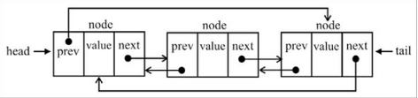
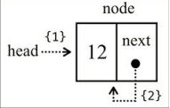
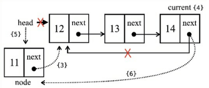
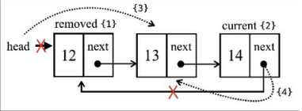

## Listas Circulares
- Possuem uma particularidade, o primeiro elemento aponta para o último e o último aponta para o primeiro.
- Elas herdam todos os métodos da lista ligada, porém os métodos INSERT e REMOVE, possuem algumas diferenças. 

### MÉTODO INSERT
~~~javascript
 insert(element, index) {
        if (index >= 0 && index <= this.count) {
            const node = new Node(element);
            let current = this.head;
            if (index === 0) {

                if (this.head === null) {
                    this.head = node;
                    node.next = this.head;
                } else {
                    node.next = current;
                    current = this.getElementAt(this.size());
                    this.head = node;
                    current.next = this.head;
                }
            }

            this.count++;
            return true;
        }
        return false;
    };
~~~

- Inserindo o elemento com lista vazia

- Inserindo elemento com lista cheia

### MÉTODO REMOVE
~~~javascript
  removeAt(index) {
        if (index >= 0 && index < this.count) {
            let current = this.head;
            if (index === 0) {

                if (this.size() === 1) {
                    this.head = undefined;
                } else {
                    const removed = this.head;
                    current = this.getElementAt(this.size());
                    this.head = this.head.next;
                    current.next = this.head;
                    current = removed;
                }
            } else {
                let previous = this.getElementAt(index - 1);
                current = previous.next;
                previous.next = current.next;
            }

            this.count--;
            return current.element;
        }

        return undefined;
    };
~~~

- Removendo Elemento

