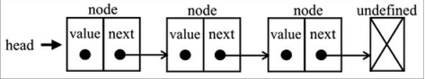
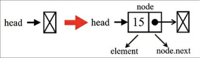
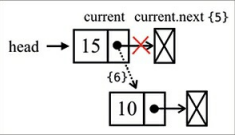

# Listas Ligadas
- As listas ligadas são uma estrutura de dados que são constituídas de um nó, que possuem um valor e um ponteiro que faz referência ao próximo nó da lista.
- As listas são mais rápidas que os arrays, quando falamos sobre inserção e remoção de itens, pois elas não precisam de uma sequência de memória livre para serem criadas. Pois como elas possuem um ponteiro para o próximo item da lista, elas podem ser colocadas em qualquer lugar da memória.
- Elas não são muito quando falamos em acessar um elemento aleatório. Como elas possuem um ponteiro para o próximo item da lista, teríamos que percorres os itens até achar o item que desejamos.

##### Exemplo de uma Lista Ligada :
  

### Criando Lista Ligada
- O arquivo NODE, é uma classe que cria um nó para nós. Este possui duas chaves : element e Next. Onde elemento é o valor do elemento que foi criado e next é a referência para o próximo elemento.
- O arquivo equals, possui uma função que faz a verificação se 2 elementos são iguais.

~~~javascript

import { Node } from "./node";
import { equals } from "./equals";

class LinkedList{
    constructor(equal = equals){
        this.count = 0;
        this.head = null;
        this.equalFn = equal;
    }
}
~~~

#### Iserindo Elementos no Final da Lista
- Lista vazia, adicionando o primeiro elemento.

~~~javascript
push(element){
        const node = new Node(element);
        let current;
        if(this.head === null){
            this.head = node;
        }
    }
~~~

  

- Lista não está vazia.

~~~javascript
else {
            current = this.head;
            while (current.next !== null) {
                current = current.next;
            };

            current.next = node;
        }

        this.count++;
~~~

- Código completo :
  ~~~javascript
    push(element) {
        const node = new Node(element);
        let current;
        if (this.head === null) {
            this.head = node;
        } else {
            current = this.head;
            while (current.next !== null) {
                current = current.next;
            };

            current.next = node;
        }

        this.count++;
    };
   ~~~
   
   
#### Percorrendo a Lista até a Posição Desejada
- Percorremos a nossa lista e retornamo o elemento de acordo com o índice passado.
  ~~~javascript
    getElementAt(index) {
        if (index >= 0 && index <= this.count) {
            let node = this.head;
            for (let i = 0; i < index && node !== null; i++) {
                node = node.next;
            }

            return node;
        }

        return undefined;
    }
   ~~~

