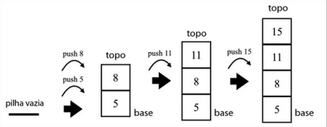
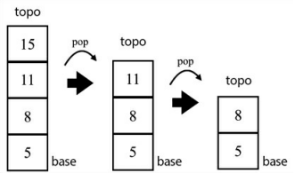

# Pilhas
- As pilhas usam o conceito de LIFO ( Último a entrar e Primeiro a sair ).
- Podemos usar a pilha com o Arrays e Objetos.

- Métodos utilizado nesta estrutura de dados:
    - ***PUSH →*** Adiciona elementos no topo da pilha.
    - ***POP →*** Remove o elemento que está no topo da pilha e retorna o seu valor.
    - ***PEEK →*** Só retorna o elemento que esta no topo da pilha.
    - ***IsEmpty →*** Devolve `true` se a pilha estiver vazia e `false` caso contrário.
    - ***Clear →*** Remove todos os elementos da pilha.
    - ***Size →*** Devolve o número de elementos contidos na pilha.

- Usando o Push :

- Usando o Pop :

> Nesta pasta temos a implementação da estrutura de dados Pilhas.
