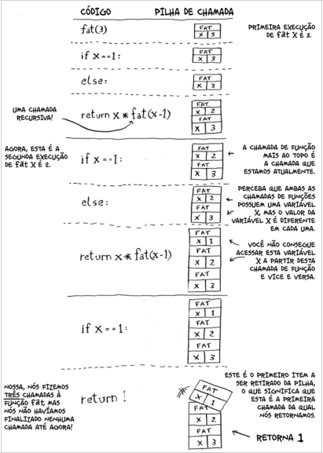
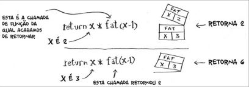

# Recursão
- Quando a nossa função chama a si mesma.
- Toda função deve ser informada quando ela deve parar.
- Temos 2 parte na função :
  - - Caso-Base : Quando a função não chama a si mesma, evitando um possível LOOP Infinito.
  - - Caso-Recursivo : Quando ela chama a si mesma.

- Não é muito bom usar a recursão quando temos muitos elementos na lista, pois ela utiliza Pilha de chamada. A pilha de chamada ocupar memória a cada vez que é utizada, e isso não é muito performática em caso de se utilizar em muitos elementos. Quando possuimos muitos elementos é melhor trocar a recursão por um LOOP.

- Pilha de chamada com Recursão :

> Nesta pasta temos 2 exemplos de recursão no arquivo JS
