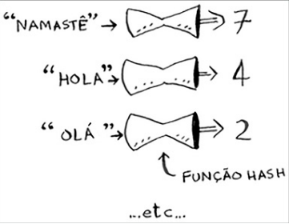

# Tabelas Hash
- As tabelas hash, são constituídas de uma função Hash e um Array.

### Funções Hash
- As funções hash, recebem como entrada uma String e retornam um número :
- Para que elas funcionem, elas devem :
  - - Ser consistente, ou seja, retornar o mesmo resultado para a mesma entrada. Se foi adicionado a palavra 'HASH' e o retorno foi 6, então sempre que a palavra 'HASH' for colocada como Input , sempre deve retornar o 6.
  - - Devem retornar diferentes números para diferentes strings. Não adiantaria ela retornar 1 para todas as entradas. 

- Como disse la em cima a tabela hash é composto por função Hash e um Array, como a função hash se relaciona com o Array ? :
  - - O número de saída da nossa função corresponde ao número do índice do array.
  - - A nossa NUNCA irá retornar um número que não seja um índice, pois ela sabe qual o tamanho do nosso array.

- Exemplo :
  - - A função hash recebeu o valor 'maçã', então retornou um número 3. No índice 3 do nosso array, irá ser guardado o valor que representa a 'maçã', pode ser um número, ou qualquer outra coisa.

